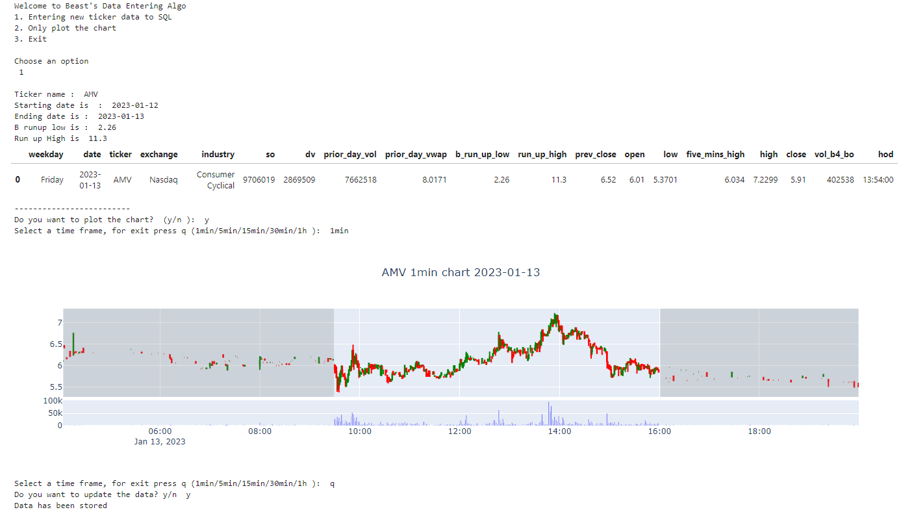

# ETL_Automation
Acquire data from an external data source, process it to align with your investment strategy, and load it into a PostgreSQL database. You also have the ability to plot the intraday chart of stocks, similar to thinkorswim.

# Necessity
API key from polygon.io

# A snapshot of the bot

